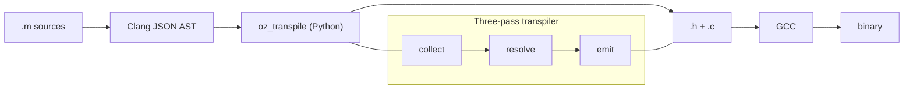

# Objective-Z

Objective-C transpiler for Zephyr RTOS.

Converts `.m` sources to plain C via Clang AST analysis — no ObjC runtime needed. Packaged as a Zephyr module with a Platform Abstraction Layer (PAL) for zero-cost Zephyr integration.

## Why Objective-Z?

Several languages promise better abstractions over C for embedded development. We evaluated each against the reality of building on Zephyr RTOS, where the entire ecosystem — kernel, drivers, build system, macros — is C.

- **[Rust](https://github.com/zephyrproject-rtos/zephyr-lang-rust)** — Amazing language, but adopting it means emigrating, not just learning new syntax. The borrow checker rewires how developers think about lifetimes — far from the C mindset. The toolchain is a separate compiler from Zephyr's, creating two-ABI friction. Every kernel API needs FFI bindings that break on upstream updates. Kernel-level development is effectively off-limits. Binaries are harder to audit for WCET.

- **[C++](https://docs.zephyrproject.org/latest/develop/languages/cpp/index.html)** — Looks C-compatible but isn't. Zephyr's macro-heavy API (`K_THREAD_DEFINE`, `K_SEM_DEFINE`, `DEVICE_DT_DEFINE`) relies on C-specific preprocessor behavior; compiling with `g++` changes the language under the macros. Beyond that, C++ has grown so aggressively that it's fractured into eras — a developer comfortable with C++03 faces a nearly foreign language in C++20/23. It keeps trying to become something else, which is bad for teams rooted in C.

- **[Zig](https://github.com/nodecum/zig-zephyr)** — The most sympathetic "better C": no hidden control flow, `comptime` instead of macros, good C interop. But it shares Rust's separate-compiler problem and deliberately does not support OOP — no classes, no inheritance, no method dispatch. Approximating interfaces requires acrobatics the language doesn't enforce. A genuine step over C, but it lacks the abstraction vocabulary Objective-Z provides.

- **[Nim](https://github.com/EmbeddedNim/nephyr)** — The closest competitor: it also transpiles to C, has `--mm:arc` for deterministic memory management, and an `EmbeddedNim` community with a Zephyr wrapper (`nephyr`). However, despite transpiling to C, Nim is a completely different language — Python-inspired syntax, significant whitespace, its own module system and metaprogramming model. The learning curve for a C team is substantial; it's not incremental. Zephyr's C macros (`K_THREAD_DEFINE`, `DEVICE_DT_DEFINE`, etc.) don't pass through Nim's FFI cleanly — bindings must manually replicate what the macros expand to, creating a fragile maintenance burden on every Zephyr update. Nim's OOP model uses garbage-collected reference types by default, the generated C is Nim-idiomatic rather than human-auditable, and the embedded ecosystem remains small.

- **[Swift](https://github.com/swiftlang/swift-embedded-examples)** — The obvious question given Objective-C heritage. Embedded Swift (announced WWDC 2024) strips runtime reflection and existentials to target microcontrollers, and has experimental Zephyr integration. But it's still a separate LLVM-based compiler with its own ABI, the embedded subset is experimental, and it disables the very features (protocols as existentials, ARC with full runtime) that make Swift feel like Swift. You get a hobbled Swift instead of full Objective-C lowered to clean C.

- **[Ada/SPARK](https://github.com/zephyr-ada/ada-project-example)** — The establishment answer for safety-critical embedded, with proven formal verification. Deserves respect. But there is no official Zephyr support — only a proof-of-concept requiring a custom SDK rebuild with GNAT enabled. The language, toolchain, and ecosystem are unfamiliar to teams coming from C. Adoption cost is enormous for what amounts to a parallel universe.

- **[Lua](https://github.com/rodrigopex/lua_zephyr)** — Tiny interpreter, easy to embed in C, widely used for scripting in games and IoT gateways. But it's interpreted — every instruction pays a runtime dispatch cost that destroys WCET analyzability. The VM requires heap allocation for tables, strings, and closures. You can strip it down (eLua, Lua-RTOS), but you're still paying for an interpreter loop where you need deterministic, compiled code. It adds a scripting layer on top of C rather than improving how you write the C itself.

- **[Go/TinyGo](https://tinygo.org)** — The garbage collector is a one-line disqualifier for zero-heap, deterministic, ISR-safe embedded systems.

### The Objective-Z answer

These alternatives fail for different reasons — a separate compiler (Rust, Zig, Swift, Ada), broken macro compatibility (all of them, even C++ and Nim), an unfamiliar language model (Rust, Nim, Ada), a hobbled feature subset (Swift), an interpreter with heap allocation (Lua), or a garbage collector (Go) — but they share one root cause: they ask the embedded C team to leave C.

Objective-Z doesn't. The developer writes Objective-C — a strict superset of C — and the entire Zephyr API surface (macros, kernel calls, devicetree accessors, everything) is directly visible and usable in the Objective-C source with zero bindings. The transpiler then converts it to plain, auditable C. The compiler only ever sees C. The linker only ever sees C. No new compiler. No FFI bindings. No interpreter. No garbage collector. No moving target. No unfamiliar syntax. The team gains classes, protocols, ARC-based RAII, and deterministic dispatch without leaving the world they already understand. And because the transpiler output is plain C with static dispatch, it performs at similar speed to C++ — without the macro incompatibilities, the fractured standard, or the compiler change.

## Design

### Static-first design

Existing Objective-C runtimes — Apple libobjc, GNUstep libobjc2, ObjFW, mulle-objc — assume a general-purpose heap. All dispatch tables, class tables, selector tables, and object instances are `malloc`'d at runtime. This is fine for desktop/mobile but incompatible with deterministic embedded firmware on MCUs with 64-512 KB RAM and no MMU.

Objective-Z inverts this: the transpiler converts `.m` files to plain C at build time via Clang JSON AST analysis. Dispatch tables are `const` vtable arrays in `.rodata` (FLASH), indexed by `class_id` — zero RAM overhead. When the receiver type is known at transpile time, protocol calls are resolved to direct function calls via compile-time dispatch (`OZ_SEND` macro with token concatenation). Object instances are served from per-class `k_mem_slab` pools (BSS), auto-generated from AST analysis. No heap allocation needed.

### No dynamic ObjC magic

Features that require unbounded runtime allocation — KVO, method swizzling, dynamic class creation, associated objects, weak references, message forwarding — are removed. Only the core language features that can be fully resolved at build time remain: classes, protocols, categories, properties, blocks, ARC.

### Zephyr-native

Built on Zephyr primitives (`k_mem_slab`, `SYS_INIT`, `k_spinlock_t`, `atomic_t`), not POSIX. No libc `malloc` dependency.

## Features

### Dispatch

- **Static dispatch** — direct C function calls for non-protocol methods (12 cycles)
- **Compile-time dispatch** — protocol calls resolved to direct calls when receiver type is known at transpile time (12 cycles)
- **Protocol vtable dispatch** — `const` vtable arrays in `.rodata` (zero RAM), 19 cycles polymorphic fallback for `id`-typed receivers
- **Class methods** — static function calls

### Memory Management

- **Compile-time ARC** — scope-based retain/release, auto-dealloc, break/continue cleanup
- **Per-class slab pools** — auto-generated from AST analysis, zero heap overhead
- **`@autoreleasepool`** — scoped memory management
- **Foundation classes** — `OZString`, `OZArray`, `OZDictionary`, `OZQ31` with fast enumeration

### Language Features

- **Categories** — merged at AST collection time
- **`@property` / `@synthesize`** — atomic and strong semantics
- **`@synchronized`** — RAII spinlock via OZSpinLock
- **Blocks** — non-capturing blocks transpiled to static C functions
- **`__block` variables** — promoted to file-scope static
- **Fast enumeration** — `for (id obj in collection)` via IteratorProtocol
- **Boxed literals** — `@42`, `@3.14f`, `@YES`
- **Collection literals** — `@[a, b, c]`, `@{key: value}`
- **Subscript syntax** — `array[0]`, `dict[@"key"]`
- **Lightweight generics** — typed collections
- **`+initialize`** — auto-called before `main()` via `SYS_INIT` (singleton pattern)

### Tooling

- **Three-pass transpiler** — Clang JSON AST -> collect -> resolve -> emit -> pure C
- **Platform Abstraction Layer** — zero-cost `static inline` with Zephyr and host backends
- **clangd IDE support** — auto-generated `compile_commands.json`

## How It Compares

All benchmarks on **nRF52833 DK** (ARM Cortex-M4F @ 64 MHz), DWT cycle counter, `-O2`. OZ benchmark is pure Objective-C transpiled to C. Single inheritance only (ObjC limitation).

### Speed (cycles)

| Operation                         |   C++ |    OZ | Notes |
| --------------------------------- | ----: | ----: | ----- |
| Static / direct call              |    12 |    12 | Both resolve at compile time |
| Virtual / vtable dispatch         |    14 |    21 | OZ: const array, C++: vptr indirection |
| Slab alloc + init + release       |   105 |   215 | C++ placement-new from slab |
| Atomic inc (retain)               |     7 |    22 | Both inline atomics |
| retain + release pair             |    17 |    44 | |
| Property get (nonatomic)          |    12 |    12 | |
| Property get (atomic, k_spinlock) |    12 |    10 | Same Zephyr primitive |
| @synchronized (k_spinlock)        |    15 |   266 | OZ: RAII OZSpinLock alloc+free |
| Block / lambda (non-capturing)    |    12 |    12 | Both compile to fn ptrs |
| std::function (int capture)       |    16 |    -- | No OZ equivalent |
| Raw int32_t[] sum (10 elems)      |    81 |    99 | Both raw C arrays, no boxing |
| String*[10] loop + length()       |   263 |   483 | Fair: both object arrays with method call |
| String iterator (virtual)         |   211 |   341 | Fair: both virtual dispatch per step |
| dynamic_cast (hit) / isKindOfClass |    12 |    -- | OZ introspection via C API |

### Memory (bytes per object)

| Metric                        |   C++ |    OZ | Notes |
| ----------------------------- | ----: | ----: | ----- |
| Base object sizeof            |     8 |     8 | Both: metadata + refcount |
| Slab alloc overhead           |   n/a |     0 | OZ: block = sizeof |
| Heap alloc overhead           |     4 |   n/a | C++ sys_heap header |
| shared_ptr control block      |    12 |     0 | OZ: inline refcount |
| OZQ31 / SimpleString       |    16 |    12 | OZ Q31+shift vs vptr+data+len |

### Firmware Footprint

| Benchmark      | Metric    |    C++ |     OZ |   Diff |
| -------------- | --------- | -----: | -----: | -----: |
| Speed (`-O2`)  | text      | 50,388 | 35,756 |   -29% |
| Speed (`-O2`)  | data      |    312 |    568 |   +82% |
| Speed (`-O2`)  | bss       |  9,733 |  8,445 |   -13% |
| Speed (`-O2`)  | **total** | **60,433** | **44,769** | **-26%** |
| Memory (`-Os`) | text      | 22,840 | 21,348 |    -7% |
| Memory (`-Os`) | data      |    180 |    180 |     0% |
| Memory (`-Os`) | bss       | 15,558 |  7,344 |   -53% |
| Memory (`-Os`) | **total** | **38,578** | **28,872** | **-25%** |

> **OZ firmware is 26% smaller at `-O2`** (44 KB vs 60 KB) and **25% smaller at `-Os`** (28 KB vs 38 KB) than equivalent C++. C++ template instantiation and STL inlining inflate code size significantly on embedded targets.

### Foundation Classes

| Class              | Description                                              |
| ------------------ | -------------------------------------------------------- |
| `OZObject`         | Root class — alloc, init, dealloc, retain/release, isEqual |
| `OZString`         | Immutable strings — cStr, length, isEqual                |
| `OZMutableString`  | Mutable strings — appendString, appendFormat             |
| `OZArray`          | Immutable arrays — count, objectAtIndex, for-in          |
| `OZDictionary`     | Immutable dictionaries — count, objectForKey, for-in     |
| `OZQ31`          | Q31+shift fixed-point — Zephyr sensor_decode interop, arithmetic |
| `OZHeap`           | Dynamic heap allocator — initWithBuffer, allocWithHeap   |
| `OZSpinLock`       | RAII spinlock for `@synchronized` blocks                 |
| `OZDefer`          | Scope-guard for deterministic cleanup                    |
| `OZLog`            | printf-style logging with `%@` object specifier          |

## Quick Start

```sh
# Clone and enter
git clone https://github.com/peixotooo/objective-z.git
cd objective-z

# Build the hello_world sample
just rebuild

# Run in QEMU
just run
```

Expected output:

```
Hello, world from class
Hello, world from object
```

## Samples

12 samples under `samples/`, each demonstrating different transpiler features:

| Sample                 | Description                                        |
| ---------------------- | -------------------------------------------------- |
| `hello_world`          | Basic class and instance method dispatch            |
| `hello_category`       | Category extensions (adding methods to classes)     |
| `arc_demo`             | ARC lifecycle, scoped cleanup, singletons, threads  |
| `mem_demo`             | ARC memory management, autorelease pools            |
| `pool_demo`            | Static slab pools, `@autoreleasepool`, `@synchronized` |
| `transpiled_blocks`    | Blocks, `__block` variables, fast enumeration       |
| `transpiled_literals`  | Boxed literals (`@42`) and collection literals (`@[]`, `@{}`) |
| `transpiled_generics`  | Lightweight generics with typed collections         |
| `transpiled_led`       | LED control demo (OZLed class)                      |
| `gpio_demo`            | GPIO input/output with Zephyr devicetree            |
| `zbus_objc`            | Zephyr zbus pub/sub messaging                       |
| `zbus_service`         | Request-response service pattern                    |

Build a specific sample:

```sh
just project_dir=samples/arc_demo rebuild
just run
```

### hello_world

```objc
#import <Foundation/Foundation.h>

@interface MyFirstObject: OZObject
- (void)greet;
+ (void)greet;
@end

@implementation MyFirstObject

- (void)greet
{
    OZLog("Hello, world from object");
}

+ (void)greet
{
    OZLog("Hello, world from class");
}

@end

int main(void)
{
    [MyFirstObject greet];

    MyFirstObject *hello = [[MyFirstObject alloc] init];
    [hello greet];

    return 0;
}
```

The transpiler converts this to plain C: `MyFirstObject_greet(self)` for instance methods, `MyFirstObject_class_greet()` for class methods, and `OZObject_slab_alloc()`/`OZObject_init()` for object creation. The generated code compiles with GCC — no ObjC compiler or runtime needed at build time.

## Architecture



### Transpiler Pipeline

Three-pass architecture in `tools/oz_transpile/`:

1. **Collect** (`collect.py`) — Walks Clang JSON AST nodes, builds `OZModule` with classes, methods, ivars, protocols, categories
2. **Resolve** (`resolve.py`) — Validates hierarchy, assigns topological class IDs, computes `base_depth`, classifies dispatch (STATIC vs PROTOCOL)
3. **Emit** (`emit.py`) — Generates per-class `.h`/`.c` files + `oz_dispatch.h`/`.c` (`const` vtable arrays, compile-time dispatch macros, slab definitions)

### Platform Abstraction Layer

Zero-cost `static inline` abstraction in `include/platform/`:

| Header                  | Purpose                                        |
| ----------------------- | ---------------------------------------------- |
| `oz_platform.h`         | `#ifdef` router (Zephyr vs Host)               |
| `oz_platform_zephyr.h`  | `k_mem_slab`, Zephyr atomics, `k_spinlock_t`, `printk` |
| `oz_platform_host.h`    | malloc-backed slab, C11 `stdatomic`, `printf`  |
| `oz_platform_types.h`   | Shared type definitions                        |
| `oz_lock.h`             | OZSpinLock RAII spinlock for `@synchronized`    |
| `oz_assert.h`           | Assertion macros                               |

All PAL functions vanish at `-O1+` — zero runtime overhead.

### Generated Code

For each class, the transpiler emits:

- **`ClassName.h`** — struct definition, method prototypes, vtable extern
- **`ClassName.c`** — method implementations, vtable array, slab pool definition
- **`oz_dispatch.h`** — class ID enum, `OZ_IMPL_*` compile-time dispatch macros, `OZ_SEND()` generic macro, `OZ_PROTOCOL_SEND_*` polymorphic fallback macros
- **`oz_dispatch.c`** — `const` vtable arrays (`OZ_PROTOCOL_RESOLVE_*`) in `.rodata`, class introspection tables

## Using in Your Project

### 1. Add Objective-Z to your west manifest

In your application's `west.yml`, add objective-z as a project:

```yaml
manifest:
  remotes:
    - name: zephyrproject-rtos
      url-base: https://github.com/zephyrproject-rtos

  projects:
    - name: zephyr
      remote: zephyrproject-rtos
      revision: main
      import:
        name-allowlist:
          - cmsis

    - name: objective-z
      url: https://github.com/rodrigopex/objective-z/
      revision: main
      path: objective-z

  self:
    path: my_app
```

Then run `west update` to fetch the module.

### 2. Directory layout

```
my_app/
├── west.yml
├── CMakeLists.txt
├── prj.conf
└── src/
    └── main.m
```

### 3. CMakeLists.txt

```cmake
cmake_minimum_required(VERSION 3.20.0)

find_package(Zephyr REQUIRED HINTS $ENV{ZEPHYR_BASE})
project(my_app)

# Transpile .m sources to C (ARC always enabled)
objz_transpile_sources(app src/main.m)
```

### 4. prj.conf

```ini
CONFIG_OBJZ=y
```

The transpiler automatically includes Foundation classes (OZObject, OZString, OZArray, OZDictionary, OZQ31) and generates slab pools for all classes found in the AST.

### 5. Write your .m file

```objc
#import <Foundation/Foundation.h>

@interface Sensor: OZObject {
    int _value;
}
- (void)setValue:(int)v;
- (int)value;
@end

@implementation Sensor
- (void)setValue:(int)v { _value = v; }
- (int)value { return _value; }

- (void)dealloc
{
    OZLog("Sensor dealloc (value=%d)", _value);
}
@end

int main(void)
{
    Sensor *s = [[Sensor alloc] init];
    [s setValue:42];
    OZLog("value=%d", [s value]);
    /* ARC releases s here -> dealloc fires */
    return 0;
}
```

### 6. Build

```sh
west build -p -b mps2/an385 .
```

### CMake API

```
objz_transpile_sources(<target> <source1.m> [source2.m ...]
    [ROOT_CLASS <name>]
    [POOL_SIZES <Class1=N,Class2=M,...>]
    [INCLUDE_DIRS <dir1> [dir2 ...]]
)
```

| Parameter      | Default    | Description                              |
| -------------- | ---------- | ---------------------------------------- |
| `ROOT_CLASS`   | `OZObject` | Root class name for hierarchy resolution |
| `POOL_SIZES`   | auto       | Override slab pool sizes per class       |
| `INCLUDE_DIRS` | --         | Additional include directories for AST   |

## Prerequisites

- Zephyr SDK + west (see [Zephyr Getting Started](https://docs.zephyrproject.org/latest/develop/getting_started/index.html))
- Clang 20+ (for AST analysis — Apple Clang works for ARM, Homebrew LLVM for RISC-V; older versions may crash on ObjC JSON AST dump)
- Python 3
- [just](https://github.com/casey/just) (build automation)

## Configuration

`CONFIG_OBJZ` is the only Kconfig option. It enables the transpiler pipeline and auto-selects `STATIC_INIT_GNU`.

Supported architectures:

- ARM Cortex-M
- ARM Cortex-A
- RISC-V 32/64-bit (requires LLVM Clang, not Apple Clang)

## Build Commands

Requires [just](https://github.com/casey/just). Default board: `mps2/an385`.

| Command                | Description                            |
| ---------------------- | -------------------------------------- |
| `just build` / `just b`  | Incremental build                   |
| `just rebuild`         | Pristine rebuild                       |
| `just run` / `just r`    | Run in QEMU                         |
| `just flash` / `just f`  | Flash to hardware                   |
| `just monitor` / `just m` | Serial monitor (tio)               |
| `just clean` / `just c`  | Remove build directory               |
| `just test` / `just t`   | Run twister on all samples (ARM)    |
| `just test-transpiler` | Run transpiler pytest suite            |
| `just test-behavior`   | Run compiled behavior tests            |
| `just test-adapted`    | Run adapted upstream tests             |
| `just smoke`           | Run host-side PAL smoke test           |
| `just bench`           | Run ObjC benchmark (build + flash)     |
| `just bench-cpp`       | Run C++ comparison benchmark           |
| `just bench-mem`       | Run memory comparison (C, C++, ObjC)   |
| `just test-bench`      | Run all benchmarks via twister (HW)    |
| `just transpile`       | Run OZ transpiler directly             |
| `just ast-dump file`   | Clang JSON AST dump                    |

Override defaults:

```sh
just project_dir=samples/arc_demo board=nucleo_f429zi rebuild
just board=qemu_riscv32 rebuild   # RISC-V target
```

## Limitations

See [docs/LIMITATIONS.md](docs/LIMITATIONS.md) for the full list. Key limitations:

- **Non-capturing blocks only** — blocks that capture local variables produce a diagnostic error
- **No `typedef`** — use explicit types
- **No `@try`/`@catch`/`@throw`** — exception handling not supported
- **No dynamic dispatch** for non-protocol methods — all resolved statically
- **OZQ31**: Q31+shift fixed-point, converts to int8/16/32 and float (no int64/double)

<details>
<summary><strong>ARC Guide</strong></summary>

## ARC Guide

Automatic Reference Counting (ARC) is always enabled. The transpiler inserts `retain`/`release` calls at compile time — you never call them manually.

### How it works

```objc
#import <Foundation/Foundation.h>

@interface Sensor: OZObject
@property (nonatomic, strong) id delegate;
- (void)measure;
@end

@implementation Sensor
@synthesize delegate = _delegate;

- (void)measure
{
    OZLog("Measuring...");
}

- (void)dealloc
{
    OZLog("Sensor deallocated");
    /* ARC auto-inserts [super dealloc] — do NOT call it yourself */
}
@end

void demo(void)
{
    Sensor *s = [[Sensor alloc] init]; /* rc=1 */
    [s measure];
    /* ARC releases s here — dealloc fires automatically */
}
```

### Strong properties and `.cxx_destruct`

When a class has `strong` properties (or ivars), ARC generates a hidden `.cxx_destruct` method that releases them before `-dealloc` runs:

```objc
@interface Driver: OZObject
@property (nonatomic, strong) Sensor *sensor;
@end

@implementation Driver
@synthesize sensor = _sensor;

- (void)dealloc
{
    OZLog("Driver deallocated");
    /* .cxx_destruct already released _sensor before we get here */
}
@end

void demo(void)
{
    Driver *d = [[Driver alloc] init];
    d.sensor = [[Sensor alloc] init];
    /* ARC releases d -> .cxx_destruct releases sensor -> both dealloc */
}
```

### `@autoreleasepool`

Critical in loops that create temporary objects — without it, temporaries accumulate until the enclosing scope ends:

```objc
/* BAD: all 1000 temporaries live until function returns */
void process_bad(void)
{
    for (int i = 0; i < 1000; i++) {
        id tmp = [SomeFactory create];
    }
    /* all 1000 objects released here — peak memory is huge */
}

/* GOOD: each iteration drains its pool */
void process_good(void)
{
    for (int i = 0; i < 1000; i++) {
        @autoreleasepool {
            id tmp = [SomeFactory create];
            /* tmp released at end of @autoreleasepool block */
        }
    }
    /* peak memory: only 1 object at a time */
}
```

Use `@autoreleasepool` when:

- **Loops** create temporary objects
- **Worker threads** — each thread needs its own pool
- **Batch processing** — any code path that allocates many short-lived objects

### Retain cycles

ARC has no weak references (`__weak` panics at runtime). If two objects hold `strong` references to each other, neither can be deallocated:

```objc
/* PROBLEM: direct cycle — Parent <-> Child */
@interface Parent: OZObject
@property (nonatomic) Child *child;   /* strong by default */
@end

@interface Child: OZObject
@property (nonatomic) Parent *parent; /* strong — creates cycle! */
@end
```

#### Fix: use `__unsafe_unretained`

```objc
@interface Child: OZObject
@property (nonatomic, unsafe_unretained) Parent *parent; /* non-owning */
@end
```

> **Caution:** `__unsafe_unretained` pointers are not zeroed on dealloc. Ensure the owner outlives the child, or set the back-reference to `nil` before the owner is released.

#### Alternative: break the cycle manually

```objc
void no_leak(void)
{
    Node *a = [[Node alloc] init];
    Node *b = [[Node alloc] init];
    a.next = b;
    b.next = a;

    b.next = nil; /* break cycle before scope exit */
    /* ARC releases a -> releases b -> both dealloc */
}
```

### ARC rules summary

| Do                                      | Don't                                          |
| --------------------------------------- | ---------------------------------------------- |
| Use `objz_transpile_sources()` in CMake | Call `retain`, `release`, or `autorelease`      |
| Let the compiler manage object lifetime | Call `[super dealloc]` — ARC inserts it         |
| Use `@autoreleasepool` in loops/threads | Create strong reference cycles                  |
| Use `strong` properties for ownership   | Assume temporaries are released immediately     |
| Break cycles manually before scope exit | Use `__weak` (not supported, panics at runtime) |

</details>

<details>
<summary><strong>Benchmark</strong></summary>

## Benchmark (OZ-070)

Comprehensive OZ vs C++ benchmarks on **nRF52833 DK** (ARM Cortex-M4F @ 64 MHz), DWT cycle counter, overhead-calibrated. OZ benchmark is pure Objective-C transpiled to C. Single inheritance only (ObjC limitation).

```sh
just board=nrf52833dk/nrf52833 bench       # OZ speed benchmark (6 sections)
just board=nrf52833dk/nrf52833 bench-cpp   # C++ speed benchmark (7 sections)
just board=nrf52833dk/nrf52833 bench-mem   # Memory comparison (C, C++, OZ)
just test-bench                            # Run all via twister (hardware map)
just bench-footprint                       # ELF section size analysis
```

### 1. Allocation

| Operation                              | OZ (cycles) | C++ (cycles) |
| -------------------------------------- | ----------: | -----------: |
| slab alloc + init + release (Base)     |         215 |          --- |
| slab alloc + init + release (Child)    |         217 |          --- |
| slab alloc + init + release (GChild)   |         218 |          --- |
| Value type on stack                    |         --- |           12 |
| new/delete (heap)                      |         --- |          865 |
| unique_ptr create/destroy              |         --- |          517 |
| placement new + slab + dtor + free     |         --- |          105 |

### 2. Dispatch

| Operation                              | OZ (cycles) | C++ (cycles) |
| -------------------------------------- | ----------: | -----------: |
| C function pointer (baseline)          |          12 |            8 |
| Static / direct call                   |          12 |           12 |
| Class / static method                  |          12 |           12 |
| Vtable / virtual dispatch (depth=0)    |          21 |           20 |
| Vtable / virtual dispatch (depth=1)    |          29 |           14 |
| Vtable / virtual dispatch (depth=2)    |          20 |           14 |
| Block / lambda (non-capturing)         |          12 |           12 |
| std::function (int capture)            |         --- |           16 |
| std::function copy + destroy           |         --- |           42 |

### 3. Object Lifecycle

| Operation                              | OZ (cycles) | C++ (cycles) |
| -------------------------------------- | ----------: | -----------: |
| alloc + init + release                 |         218 |          --- |
| alloc + init + retain + 2x release     |         253 |          --- |
| new + delete                           |         --- |          853 |
| placement new + slab                   |         --- |          105 |
| make_unique create/destroy             |         --- |          503 |

### 4. Reference Counting

| Operation                              | OZ (cycles) | C++ (cycles) |
| -------------------------------------- | ----------: | -----------: |
| retain / atomic inc                    |          22 |            7 |
| retain + release pair                  |          44 |           17 |
| shared_ptr copy                        |         --- |            5 |
| shared_ptr copy + reset                |         --- |           12 |

### 5. Properties / Synchronization

| Operation                              | OZ (cycles) | C++ (cycles) |
| -------------------------------------- | ----------: | -----------: |
| property get (nonatomic)               |          12 |           12 |
| property set (nonatomic)               |           1 |            2 |
| property get (atomic, k_spinlock)      |          10 |           12 |
| property set (atomic, k_spinlock)      |          11 |           12 |
| @synchronized / syncNop (k_spinlock)   |         266 |           15 |

### 6. Foundation / Collections

| Operation                              | OZ (cycles) | C++ (cycles) |
| -------------------------------------- | ----------: | -----------: |
| Raw int32_t[] sum (10 elems, baseline) |          99 |           81 |
| OZArray objectAtIndex: / access        |          12 |           13 |
| String loop + length (10 items)        |         483 |          263 |
| String iterator (virtual, length)      |         341 |          211 |
| OZDictionary objectForKey: (lookup)    |         154 |          --- |

### 7. Introspection (C++ only)

| Operation                              | C++ (cycles) |
| -------------------------------------- | -----------: |
| dynamic_cast (hit)                     |           12 |
| dynamic_cast (miss)                    |           12 |
| typeid() + name()                      |            7 |

> OZ introspection uses C functions (`oz_isKindOfClass`, `oz_name`) — not yet exposed as ObjC methods.

### Object Sizes

| Object                           | OZ (B) | C++ (B) |
| -------------------------------- | -----: | ------: |
| Base (metadata + refcount)       |      8 |       8 |
| Child (+ 1 int ivar)            |     12 |      12 |
| GrandChild (+ 1 int ivar)       |     16 |      16 |
| OZString / SimpleString          |     20 |      12 |
| OZQ31 / ---               |     16 |     --- |
| OZArray / ---                    |     20 |     --- |
| OZDictionary / ---               |     24 |     --- |
| shared_ptr / ---                 |    --- |       8 |
| unique_ptr / ---                 |    --- |       4 |
| std::function<int()> / ---       |    --- |      16 |
| k_spinlock                       |    --- |       1 |

### Firmware Footprint

| Benchmark      | Metric    |    C++ |     OZ |   Diff |
| -------------- | --------- | -----: | -----: | -----: |
| Speed (`-O2`)  | text      | 50,388 | 35,756 |   -29% |
| Speed (`-O2`)  | data      |    312 |    568 |   +82% |
| Speed (`-O2`)  | bss       |  9,733 |  8,445 |   -13% |
| Speed (`-O2`)  | **total** | **60,433** | **44,769** | **-26%** |
| Memory (`-Os`) | text      | 22,840 | 21,348 |    -7% |
| Memory (`-Os`) | data      |    180 |    180 |     0% |
| Memory (`-Os`) | bss       | 15,558 |  7,344 |   -53% |
| Memory (`-Os`) | **total** | **38,578** | **28,872** | **-25%** |

### Key Takeaways

- **Vtable dispatch is comparable** — OZ const-array dispatch (21 cycles) vs C++ virtual dispatch (14-20 cycles)
- **OZ uses less RAM** — slab pools in .bss (8.4 KB) vs C++ heap + libc (9.7 KB)
- **C++ placement-new from slab is 2x faster** than OZ slab (105 vs 215 cycles) — OZ overhead comes from init + ARC release
- **@synchronized is expensive** (266 cycles) due to OZSpinLock RAII alloc+free — k_spinlock alone is 15 cycles
- **Block invocation matches lambda** — both compile to function pointers
- **Raw array iteration is near-parity** — OZ 99 vs C++ 81 cycles for int32_t[10] sum (1.2x)
- **Object array iteration is 1.8x slower** — OZ 483 vs C++ 263 cycles for string loop + length(); fair comparison with both sides calling a virtual method per element
- **OZ text is 29% smaller** at `-O2` (36 KB vs 50 KB) — C++ template/STL inlining inflates code size
- **OZ total firmware is 26% smaller** at `-O2` (45 KB vs 60 KB)

<details>
<summary>Legacy Runtime Reference</summary>

The following data is from the retired legacy ObjC runtime (`objc_msgSend`, heap allocation, ARC runtime). These benchmarks no longer build — the legacy runtime compilation path has been retired in favor of the transpiler.

#### Message Dispatch (Legacy)

With flat dispatch table (`CONFIG_OBJZ_FLAT_DISPATCH=y`):

| Operation                              | Cycles |    ns |
| -------------------------------------- | -----: | ----: |
| C function call (baseline, cached IMP) |     13 |   520 |
| `objc_msgSend` (instance method)       |    205 | 8,200 |
| `objc_msgSend` (class method)          |    212 | 8,480 |
| `objc_msgSend` (inherited depth=1)     |    205 | 8,200 |
| `objc_msgSend` (inherited depth=2)     |    205 | 8,200 |

Without flat dispatch (`CONFIG_OBJZ_FLAT_DISPATCH=n`):

| Operation                              | Cycles |     ns |
| -------------------------------------- | -----: | -----: |
| C function call (baseline, cached IMP) |     13 |    520 |
| `objc_msgSend` (instance method)       |    560 | 22,400 |
| `objc_msgSend` (class method)          |    743 | 29,720 |
| `objc_msgSend` (inherited depth=1)     |    887 | 35,480 |
| `objc_msgSend` (inherited depth=2)     |  1,328 | 53,120 |

#### Object Lifecycle (Legacy)

| Operation                        | Cycles |      ns |
| -------------------------------- | -----: | ------: |
| alloc/init/release (heap)        |  4,474 | 178,960 |
| alloc/init/release (static pool) |  2,151 |  86,040 |

#### Reference Counting (Legacy)

| Operation                          | Cycles |     ns |
| ---------------------------------- | -----: | -----: |
| retain (via dispatch)              |    240 |  9,600 |
| retain + release pair              |    320 | 12,800 |
| `objc_retain` (ARC, direct C call) |     58 |  2,320 |
| `objc_release` (ARC)               |    135 |  5,400 |
| `objc_storeStrong` (ARC)           |    221 |  8,840 |

#### Introspection (Legacy)

| Operation                        | Cycles |     ns |
| -------------------------------- | -----: | -----: |
| `class_respondsToSelector` (YES) |    148 |  5,920 |
| `class_respondsToSelector` (NO)  |    461 | 18,440 |
| `object_getClass`                |     20 |    800 |

#### Blocks (Legacy)

| Operation                                      | Cycles |      ns |
| ---------------------------------------------- | -----: | ------: |
| C function pointer call (baseline)             |     10 |     400 |
| Global block invocation                        |     20 |     800 |
| Heap block invocation (int capture)            |     20 |     800 |
| `_Block_copy` + `_Block_release` (int capture) |  3,060 | 122,400 |
| `_Block_copy` (retain heap block)              |    154 |   6,160 |

#### Block Memory (Legacy)

| Metric                                        | Size |
| --------------------------------------------- | ---: |
| C function pointer                            |  4 B |
| Block pointer (reference)                     |  4 B |
| `struct Block_layout`                         | 20 B |
| Block + int capture (descriptor size)         | 24 B |
| Block + ObjC object capture (descriptor size) | 24 B |
| Block + `__block` int (descriptor size)       | 24 B |
| Heap cost: `_Block_copy` (int capture)        | 32 B |
| Heap cost: `_Block_copy` (obj capture)        | 32 B |
| Heap cost: `_Block_copy` (`__block` int)      | 56 B |

#### Logging (Legacy)

| Operation                    | Cycles |      ns |
| ---------------------------- | -----: | ------: |
| `printk` (simple string)     |  2,301 |  92,040 |
| `LOG_INF` (simple string)    |  2,903 | 116,120 |
| `OZLog` (simple string)      |  3,280 | 131,200 |
| `printk` (integer format)    |  2,196 |  87,840 |
| `LOG_INF` (integer format)   |  2,797 | 111,880 |
| `OZLog` (integer format)     |  3,883 | 155,320 |
| `printk` (string format)     |  2,039 |  81,560 |
| `LOG_INF` (string format)    |  2,640 | 105,600 |
| `OZLog` (string format)      |  3,892 | 155,680 |
| `OZLog` (`%@` object format) |  8,480 | 339,200 |

#### Memory Footprint (Legacy)

| Configuration         |    FLASH |      RAM | FLASH delta | RAM delta |
| --------------------- | -------: | -------: | ----------: | --------: |
| Bare Zephyr (no ObjC) | 12,104 B |  6,120 B |           - |         - |
| All features enabled  | 39,568 B | 26,020 B |   +27,464 B | +19,900 B |

Flat dispatch table cost:

| Metric           | Flat dispatch | No flat dispatch |    Delta |
| ---------------- | ------------: | ---------------: | -------: |
| FLASH            |      39,568 B |         38,384 B | +1,184 B |
| RAM (BSS + data) |      26,020 B |         22,180 B | +3,840 B |

Blocks runtime cost:

| Metric           | Blocks on | Blocks off |    Delta |
| ---------------- | --------: | ---------: | -------: |
| FLASH            |  39,568 B |   36,576 B | +2,992 B |
| RAM (BSS + data) |  26,020 B |   25,996 B |    +24 B |

</details>

### C++ Comparison

Side-by-side C++ vs Objective-Z on **nRF52833 DK** (ARM Cortex-M4F @ 64 MHz). All values in cycles.

#### Dispatch

| Operation                          | C++ | ObjC (transpiler) |
| ---------------------------------- | --: | ----------------: |
| C function pointer (baseline)      |   8 |                12 |
| Direct / static / class method     |  12 |                12 |
| Compile-time protocol dispatch     |  -- |                12 |
| Virtual / const vtable (depth=0)   |  20 |                21 |
| Virtual / const vtable (depth=1)   |  14 |                29 |
| Virtual / const vtable (depth=2)   |  14 |                20 |

> With compile-time dispatch, most protocol calls resolve to direct function calls (12 cycles) — same cost as static dispatch. Const vtable dispatch (20-29 cycles) is only used for truly polymorphic `id`-typed receivers. Vtable arrays are `const` in `.rodata` — zero RAM overhead.

#### Object Lifecycle

| Operation                              |   C++ | ObjC (transpiler) |
| -------------------------------------- | ----: | ----------------: |
| Slab / heap alloc+dealloc              |   865 |               215 |
| Placement new + dtor + slab free       |   105 |                -- |
| `unique_ptr` create/destroy            |   517 |                -- |

> Transpiler slab alloc+init+release (215 cycles) is **4x faster** than C++ `new`/`delete` (865 cycles). Both C++ placement new (105 cycles) and ObjC slab (215 cycles) use `k_mem_slab` — the extra ObjC cycles cover `init` vtable call + ARC release.

#### Reference Counting

| Operation                     |   C++ | ObjC (transpiler) |
| ----------------------------- | ----: | ----------------: |
| Atomic increment              |     7 |                22 |
| Atomic inc + dec pair         |    17 |                44 |
| `shared_ptr` copy             |     5 |                -- |
| `shared_ptr` copy + reset     |    12 |                -- |

> `OZObject_retain` (22 cycles) vs raw `atomic_fetch_add` (7 cycles) — extra cycles from null check and function call overhead. C++ `shared_ptr` operations (5-12 cycles) use inline atomics on the control block.

#### Introspection (C++)

| Operation          | Cycles |
| ------------------ | -----: |
| `dynamic_cast` (hit)  |     12 |
| `dynamic_cast` (miss) |     12 |
| `typeid()`             |      7 |

#### Lambdas / std::function (C++)

| Operation                          | Cycles |
| ---------------------------------- | -----: |
| C function pointer call            |      8 |
| Non-capturing lambda (func ptr)    |     12 |
| `std::function` invocation         |     16 |
| `std::function` copy + destroy     |     42 |

### Memory Comparison

Per-object memory cost across C, C++, and Objective-Z on **nRF52833 DK**. C/C++ use a dedicated 8 KB `sys_heap`. ObjC uses per-class `k_mem_slab` pools (zero allocator overhead).

#### Object Sizes

| Metric                     |    C |  C++ | ObjC (transpiler) |
| -------------------------- | ---: | ---: | ----------------: |
| Base object (sizeof)       |  8 B |  8 B |               8 B |
| Child (+ 1 int)            | 12 B | 12 B |              12 B |
| GrandChild (+ 2 ints)      | 16 B | 16 B |              16 B |
| Dispatch mechanism         |  4 B |  4 B |       4 B (enum)  |
| Refcount field             |  4 B |  4 B |               4 B |

> Object sizes are identical — all embed a 4 B dispatch field + 4 B refcount. The transpiler uses `enum oz_class_id` as vtable index instead of a vptr.

#### Single Allocation

| Object type   |     C |   C++ | ObjC (transpiler) |
| ------------- | ----: | ----: | ----------------: |
| Base          | 16 B  | 16 B  |               8 B |
| Child         | 16 B  | 16 B  |              12 B |
| GrandChild    | 24 B  | 24 B  |              16 B |

> Transpiler slab allocation has **zero overhead** — block size equals `sizeof(struct)`. C/C++ `sys_heap` adds 4-8 B per allocation (chunk header).

#### Bulk Allocation (20 objects)

| Object type        |      C |    C++ | ObjC (transpiler) |
| ------------------ | -----: | -----: | ----------------: |
| 20x Child          | 320 B  | 320 B  |             240 B |
| 20x GrandChild     | 480 B  | 480 B  |             320 B |
| Per GrandChild avg |  24 B  |  24 B  |              16 B |

> 33% less memory per object with slab allocation (16 B vs 24 B) — zero heap metadata overhead.

#### Smart Pointers / Reference Counting (C++)

| Metric                          |               C++ |          ObjC |
| ------------------------------- | ----------------: | ------------: |
| `sizeof(unique_ptr)`            |               4 B |             - |
| `sizeof(shared_ptr)`            |               8 B |             - |
| `make_unique` heap cost         |              16 B |             - |
| `make_shared` heap cost         |    24 B (+ ctrl)  |             - |
| `shared_ptr(new T)` heap cost   | 40 B (2 allocs)   |             - |
| Manual `atomic<int>` refcount   |     4 B (inline)  |  4 B (inline) |

> ObjC stores the refcount inline (0 extra heap cost). C++ `make_shared` adds a ~16 B control block; `shared_ptr(new T)` does two allocations totaling 40 B.

</details>

## License

Apache-2.0
